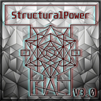

# Satisfactory Mods

Open-source mods for [Satisfactory](https://www.satisfactorygame.com/). Install released builds from [ficsit.app](https://ficsit.app) — not from this repository.

Each mod has its own folder and README with features, requirements, and roadmap.

## Mods

[StructuralPower](StructuralPower/README.md)

| | |
|---|---|
| **Added** | 2026-06-30 |
| **Published** | 2026-07-02 |
| **Updated** | 2026-07-09 |
| **Version** | 3.0.0 |
| **Next** | **3.1** — [Machines](StructuralPower/README.md#v31--machines-in-development) ([roadmap](StructuralPower/README.md#roadmap)) |

Hidden structural power bus for foundations, walls, ramps, and bridge poles. Retroactive — existing builds are wired on load. **v3.0:** vanilla-first architecture rewrite + stable load after v2.1 pain; lighting, Id panel, switches, hoverpack. Config via cfg / console / `!` chat.

Requires Satisfactory 1.2 (≥491125) and SML ^3.12.0.

---

## Generative AI Disclosure

This project uses generative AI tools **only as a minor workflow assistant**. The developer is fully responsible for mod design, logic, execution, and stability — all implementation remains hands-on.

### Permitted use

AI is limited to non-structural, repetitive, or auxiliary tasks:

- **Documentation** — README structure, install guides, changelogs, inline comments
- **JSON / boilerplate** — schema skeletons, asset registries, standard UE/SML config templates
- **Debugging** — compile errors, missing includes, stack trace interpretation
- **Reference** — C++ syntax, UE macros, public modding docs

### Human-in-the-loop

Gameplay features, balance, and performance are human-driven:

1. **Structural & logic sovereignty** — AI is not used to design core architecture, complex gameplay logic, or hook mechanics.
2. **Manual review** — No AI output is merged without review, tailoring, and efficiency checks.
3. **Rigorous testing** — The developer compiles, runs, and debugs in-game; release follows manual verification and compatibility testing.
4. **Safety & integrity** — No official game assets, protected code, or proprietary tools are submitted to public AI models.

---

## License

Source code is [GPL-3.0-or-later](LICENSE). See `SPDX-License-Identifier` headers in source files.

Copyright © 2026 Haliax.
