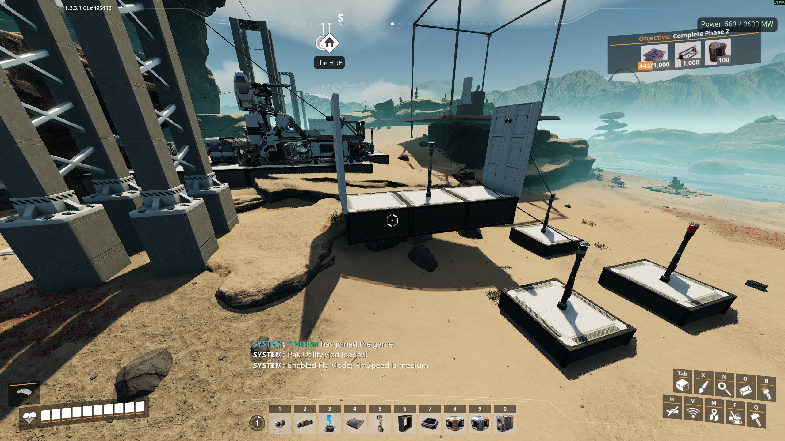

# StructuralPower

**Version 2.0.0** · Satisfactory 1.2 (≥491125) · SML ^3.12.0

Structural Power adds a hidden power network through structural pieces — foundations, walls, ramps, and bridge poles — so you can power outlets and poles without running visible wires along every segment.

## How it works

- **Retroactive** — existing structures are wired on load; no rebuild required after installing or updating
- Wire one structural outlet to your grid; connected structure shares the bus
- Ground poles, wall outlets, and towers bridge to the nearest powered structure
- Connectivity is rebuilt from world geometry on load — nothing structural is persisted, so saves can't carry stale links

## Documentation

| Topic | Link |
|-------|------|
| Overview & index | [Documentation/README.md](Documentation/README.md) |
| Player guide | [Documentation/player-guide.md](Documentation/player-guide.md) |
| Console commands | [Documentation/console-commands.md](Documentation/console-commands.md) |
| Multiplayer | [Documentation/multiplayer.md](Documentation/multiplayer.md) |
| Troubleshooting | [Documentation/troubleshooting.md](Documentation/troubleshooting.md) |
| Building from source | [Documentation/development.md](Documentation/development.md) |
| Release on SMR | [Documentation/release.md](Documentation/release.md) |

## Requirements

- Satisfactory 1.2 (≥491125)
- [SML](https://ficsit.app/mod/SML) ^3.12.0

Install via [Mod Manager](https://ficsit.app/mod/StructuralPower) (`.smod` from SMR) — not from this git repo.

## Multiplayer

- Required on remote clients (`RequiredOnRemote: true`)
- Dedicated server: include Windows Server + Linux Server in Alpakit release build

## Source

GPL-3.0 — [github.com/TheHaliax/SatisfactoryMods](https://github.com/TheHaliax/SatisfactoryMods)
